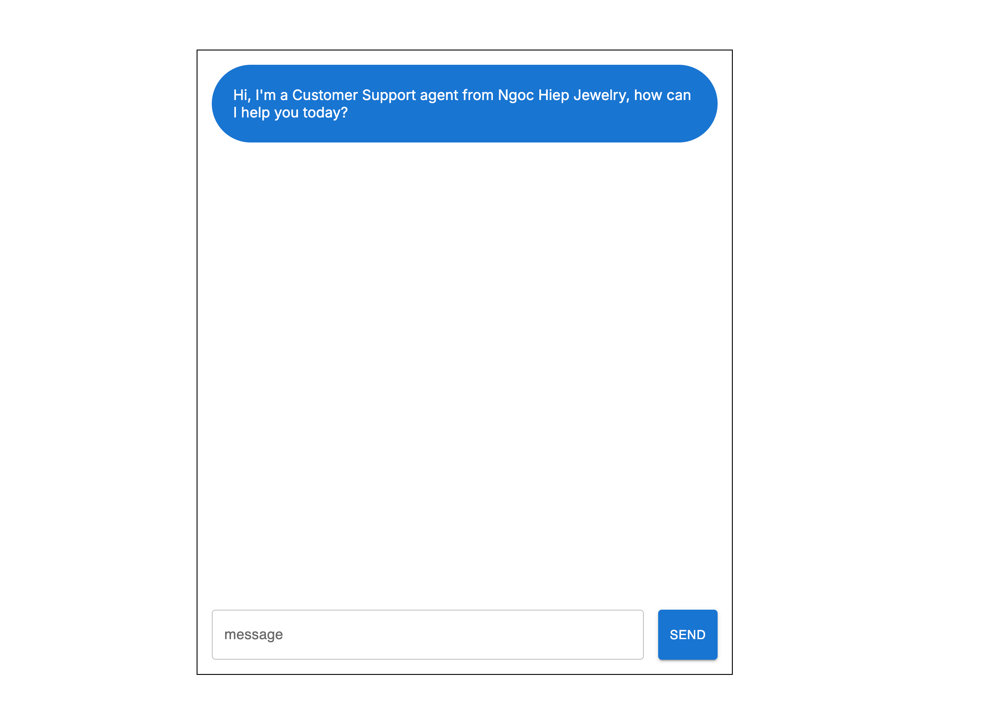

# Customer Support Chatbot with AWS Bedrock and Llama3
# Project description
This project involves developing a customer support chatbot powered by the Llama3 model, accessible via the AWS Bedrock API. The chatbot is designed to streamline customer interactions, providing real-time responses to user queries with natural, context-aware conversations. 

# App functionality
- Answer questions from customers in conversational fashion

# Stack:
- Front-end: React.js, Next.js, Material UI
- Back-end: Node.js
- LLM API: Llama3 via AWS Bedrock

# App demo:

